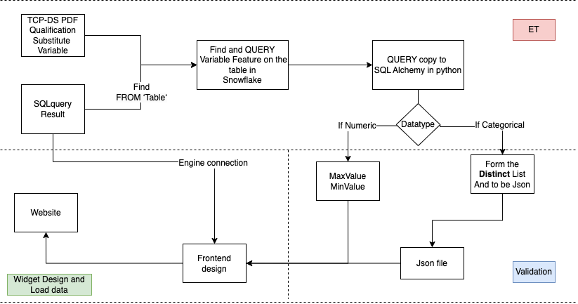

# Snowpark Python - TPC DS  - Customer Lifetime Value
 
 
 

## Quick Portral
### 
| **--->** [1.Script](TCP-Analysis-writeCode.ipynb) |

| **--->** [2.Front-end](Customer_Lifetime_Value.py) |

| **--->** [3.Website by Streamlit](https://dduan-zw-tcp-ds-big-data-explore-customer-lifetime-value-izm9gb.streamlit.app/) |

| **--->** [4.Codelab](https://dduan-zw-tcp-ds-big-data-explore-customer-lifetime-value-izm9gb.streamlit.app/) |
### Tech Stack
- Python
- Snowflake SQL
- Streamlit
- Snowflake
- Snowpark
- scikit-learn
- XGboost

## Introduction
Customer lifetime value (CLV) is a business metric used to determine the amount of money customers will spend on your products or service over time. It is the total income a business can expect from a customer over the entire period of their relationship. It’s an important metric as it costs less to keep existing customers than it does to acquire new ones, so increasing the value of your existing customers is a great way to drive growth.

## Overall Steps & Architecture

## Web

This demo utilizes the [TPC DS sample](https://docs.snowflake.com/en/user-guide/sample-data-tpcds.html) dataset that is made available via  Snowflake share. It can be configured to run on either the 10 TB or the 100 TB version of the dataset. 

This illustrates how to utilize Snowpark for feature engineering, training, and inference to answer a common question for retailers: What is the value of a customer across all sales channels? 

### Setup 

The TPC DS data is available already to you in your Snowflake account as shared database utlizing Snowflake's data sharing. This means you as the user will never incur the costs of storing this large dataset. 

 1. Create a conda environment using the provided *environment.yml* file. 
    1. `conda env create -f environment.yml `
    2. Activate that created conda environment by `conda activate snowpark_ml_test`
 2. Edit the *creds.json* file to with your account information to connect to your account. 
 3. Load Jupyter or equivalent notebook to begin executing the notebook. 

### Cost Performance

Below is a table of some observed performance stats I have observed in AWS US East Ohio. All times reported in seconds and assuming enterprise edition list pricing. 

| Dataset       	| Data prep/Feature Eng Warehouse 	| Snowpark Optimized Warehouse 	| Time for feature eng/prep 	| Cost for feature eng/prep 	| Time for training 	| Cost for training 	| Time for inference 	| Cost for inference 	|
|---------------	|---------------------------------	|------------------------------	|---------------------------	|---------------------------	|-------------------	|-------------------	|--------------------	|--------------------	|
| TPC-DS 10 TB  	| 3XL                             	| Medium                       	| 60                        	| $3.20                     	| 1400.4            	| $7.07             	| 9.8                	| $0.52              	|
| TPC-DS 100 TB 	| 3XL                             	| Medium                       	| 311.6                     	| $16.51                    	| 2210              	| $11.05            	| 24.6               	| $1.30              	|
